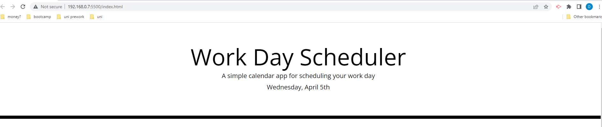
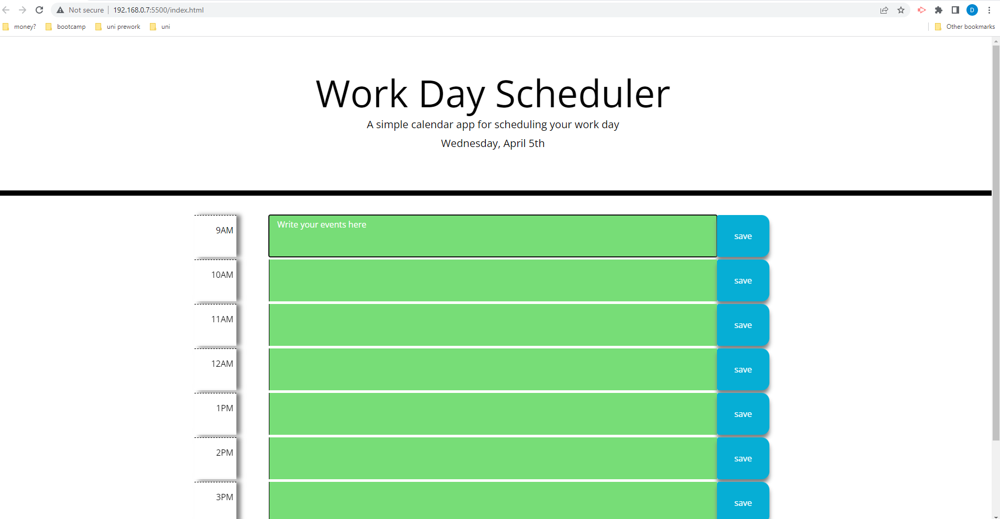

# Planner

## Description

  
The application allows a user to enter important events for the current day.

## Installation

  
The application does not need any instalation.
It can be viewed at: https://dianapurice.github.io/Planner/

## Usage

  
Find today's date at the top of the application.

  
Check you past, present and future events.

  
Write your events in the timeslots.

  
Save your events by pressing the save button.

## Credits

  
Not applicable.

## License

  
Please refer to the LICENCE in the repo.
